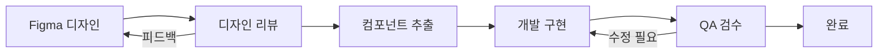

# [Design System PRD] Solar-Eye: UI/UX 디자인 시스템 명세서

| 문서 정보 | 내용 |
| :--- | :--- |
| **프로젝트명** | Solar-Eye (솔라아이) |
| **버전** | v1.0 |
| **작성일** | 2026. 01. 15 |
| **작성자** | Solar-Eye Design Team |
| **대상** | 개발팀, 디자인팀 |
| **플랫폼** | Flutter (Android / iOS) |

---

## 1. 디자인 원칙 (Design Principles)

### 1.1 핵심 가치

| 원칙 | 설명 | 적용 예시 |
| :--- | :--- | :--- |
| **🎯 명확성 (Clarity)** | 정보는 한눈에 파악될 수 있어야 함 | 신호등 UI로 상태를 직관적으로 표현 |
| **⚡ 즉시성 (Immediacy)** | 위험 상황은 즉각 인지 가능해야 함 | 결함 감지 시 붉은 알림 + 진동 |
| **🔧 실용성 (Practicality)** | 현장 작업자가 야외에서도 쉽게 사용 가능 | 큰 터치 영역, 높은 명암비 |
| **🌙 편안함 (Comfort)** | 장시간 사용에도 눈의 피로 최소화 | 다크 모드 기본 적용 |

### 1.2 디자인 목표

> 발전소 현장의 **O&M 담당자**가 강한 햇빛 아래에서도 앱을 쉽게 조작하고, 한눈에 상태를 파악할 수 있도록 한다.

---

## 2. 컬러 시스템 (Color System)

### 2.1 브랜드 컬러 (Brand Colors)

| 컬러명 | HEX | RGB | 용도 |
| :--- | :--- | :--- | :--- |
| **Solar Orange** | `#FF6B35` | 255, 107, 53 | Primary - 태양 에너지 상징 |
| **Solar Yellow** | `#FFC233` | 255, 194, 51 | Secondary - 강조, 경고 |
| **Deep Navy** | `#1A2B4A` | 26, 43, 74 | Background (Dark) |

### 2.2 시맨틱 컬러 (Semantic Colors)

> 상태 표현을 위한 **신호등 시스템** 기반 컬러

| 상태 | Light Mode | Dark Mode | 용도 |
| :--- | :--- | :--- | :--- |
| 🟢 **Success / Normal** | `#22C55E` | `#4ADE80` | 정상 상태, 성공 |
| 🟡 **Warning / Soiling** | `#EAB308` | `#FACC15` | 오염 감지, 주의 |
| 🔴 **Danger / Defect** | `#EF4444` | `#F87171` | 결함 감지, 위험 |
| 🔵 **Info** | `#3B82F6` | `#60A5FA` | 정보, 링크 |

### 2.3 중립 컬러 (Neutral Colors)

```
Light Mode                          Dark Mode
┌─────────────────────┐             ┌─────────────────────┐
│ Background  #FFFFFF │             │ Background  #0F172A │
│ Surface     #F8FAFC │             │ Surface     #1E293B │
│ Border      #E2E8F0 │             │ Border      #334155 │
│ Text-1      #0F172A │             │ Text-1      #F8FAFC │
│ Text-2      #64748B │             │ Text-2      #94A3B8 │
│ Text-3      #94A3B8 │             │ Text-3      #64748B │
│ Disabled    #CBD5E1 │             │ Disabled    #475569 │
└─────────────────────┘             └─────────────────────┘
```

### 2.4 Flutter 컬러 정의

```dart
// lib/core/theme/app_colors.dart

import 'package:flutter/material.dart';

abstract class AppColors {
  // Brand Colors
  static const solarOrange = Color(0xFFFF6B35);
  static const solarYellow = Color(0xFFFFC233);
  static const deepNavy = Color(0xFF1A2B4A);
  
  // Semantic Colors - Light
  static const successLight = Color(0xFF22C55E);
  static const warningLight = Color(0xFFEAB308);
  static const dangerLight = Color(0xFFEF4444);
  static const infoLight = Color(0xFF3B82F6);
  
  // Semantic Colors - Dark
  static const successDark = Color(0xFF4ADE80);
  static const warningDark = Color(0xFFFACC15);
  static const dangerDark = Color(0xFFF87171);
  static const infoDark = Color(0xFF60A5FA);
  
  // Light Theme Neutrals
  static const backgroundLight = Color(0xFFFFFFFF);
  static const surfaceLight = Color(0xFFF8FAFC);
  static const borderLight = Color(0xFFE2E8F0);
  static const text1Light = Color(0xFF0F172A);
  static const text2Light = Color(0xFF64748B);
  static const text3Light = Color(0xFF94A3B8);
  
  // Dark Theme Neutrals
  static const backgroundDark = Color(0xFF0F172A);
  static const surfaceDark = Color(0xFF1E293B);
  static const borderDark = Color(0xFF334155);
  static const text1Dark = Color(0xFFF8FAFC);
  static const text2Dark = Color(0xFF94A3B8);
  static const text3Dark = Color(0xFF64748B);
}
```

---

## 3. 타이포그래피 (Typography)

### 3.1 폰트 패밀리

| 용도 | 한글 | 영문/숫자 |
| :--- | :--- | :--- |
| **Primary** | Pretendard | Pretendard |
| **Monospace** | - | JetBrains Mono (수치 표시) |

> **Pretendard** 선정 이유: 가독성 우수, 다양한 굵기 지원, 오픈소스

### 3.2 타입 스케일 (Type Scale)

| 스타일명 | 크기 | 굵기 | 행간 | 용도 |
| :--- | :--- | :--- | :--- | :--- |
| **Display** | 32px | Bold (700) | 1.2 | 메인 대시보드 헤더 |
| **Headline L** | 24px | SemiBold (600) | 1.3 | 섹션 제목 |
| **Headline M** | 20px | SemiBold (600) | 1.3 | 카드 제목 |
| **Title L** | 18px | Medium (500) | 1.4 | 리스트 항목 제목 |
| **Title M** | 16px | Medium (500) | 1.4 | 서브 제목 |
| **Body L** | 16px | Regular (400) | 1.5 | 본문 (기본) |
| **Body M** | 14px | Regular (400) | 1.5 | 본문 (보조) |
| **Label L** | 14px | Medium (500) | 1.4 | 버튼 텍스트 |
| **Label M** | 12px | Medium (500) | 1.4 | 칩, 뱃지 |
| **Caption** | 12px | Regular (400) | 1.4 | 설명, 타임스탬프 |

### 3.3 Flutter 타이포그래피 정의

```dart
// lib/core/theme/app_typography.dart

import 'package:flutter/material.dart';

abstract class AppTypography {
  static const String fontFamily = 'Pretendard';
  static const String monoFontFamily = 'JetBrainsMono';
  
  static TextStyle display = const TextStyle(
    fontFamily: fontFamily,
    fontSize: 32,
    fontWeight: FontWeight.w700,
    height: 1.2,
  );
  
  static TextStyle headlineL = const TextStyle(
    fontFamily: fontFamily,
    fontSize: 24,
    fontWeight: FontWeight.w600,
    height: 1.3,
  );
  
  static TextStyle headlineM = const TextStyle(
    fontFamily: fontFamily,
    fontSize: 20,
    fontWeight: FontWeight.w600,
    height: 1.3,
  );
  
  static TextStyle titleL = const TextStyle(
    fontFamily: fontFamily,
    fontSize: 18,
    fontWeight: FontWeight.w500,
    height: 1.4,
  );
  
  static TextStyle titleM = const TextStyle(
    fontFamily: fontFamily,
    fontSize: 16,
    fontWeight: FontWeight.w500,
    height: 1.4,
  );
  
  static TextStyle bodyL = const TextStyle(
    fontFamily: fontFamily,
    fontSize: 16,
    fontWeight: FontWeight.w400,
    height: 1.5,
  );
  
  static TextStyle bodyM = const TextStyle(
    fontFamily: fontFamily,
    fontSize: 14,
    fontWeight: FontWeight.w400,
    height: 1.5,
  );
  
  static TextStyle labelL = const TextStyle(
    fontFamily: fontFamily,
    fontSize: 14,
    fontWeight: FontWeight.w500,
    height: 1.4,
  );
  
  static TextStyle labelM = const TextStyle(
    fontFamily: fontFamily,
    fontSize: 12,
    fontWeight: FontWeight.w500,
    height: 1.4,
  );
  
  static TextStyle caption = const TextStyle(
    fontFamily: fontFamily,
    fontSize: 12,
    fontWeight: FontWeight.w400,
    height: 1.4,
  );
  
  // 수치 표시용 Mono
  static TextStyle mono = const TextStyle(
    fontFamily: monoFontFamily,
    fontSize: 16,
    fontWeight: FontWeight.w500,
  );
}
```

---

## 4. 간격 시스템 (Spacing System)

### 4.1 베이스 단위

> **4px 그리드** 기반 (Flutter 기본 권장)

| 토큰 | 값 | 용도 |
| :--- | :--- | :--- |
| `space-1` | 4px | 최소 간격, 아이콘-텍스트 |
| `space-2` | 8px | 관련 요소 간 간격 |
| `space-3` | 12px | 소형 컴포넌트 내부 패딩 |
| `space-4` | 16px | 기본 패딩, 컨테이너 내부 |
| `space-5` | 20px | 중형 컴포넌트 간 간격 |
| `space-6` | 24px | 섹션 간 간격 |
| `space-8` | 32px | 대형 섹션 구분 |
| `space-10` | 40px | 페이지 상하 여백 |
| `space-12` | 48px | 주요 섹션 구분 |

### 4.2 Flutter 간격 정의

```dart
// lib/core/theme/app_spacing.dart

abstract class AppSpacing {
  static const double space1 = 4.0;
  static const double space2 = 8.0;
  static const double space3 = 12.0;
  static const double space4 = 16.0;
  static const double space5 = 20.0;
  static const double space6 = 24.0;
  static const double space8 = 32.0;
  static const double space10 = 40.0;
  static const double space12 = 48.0;
  
  // 화면 패딩
  static const double screenPaddingH = 16.0;  // 좌우
  static const double screenPaddingV = 24.0;  // 상하
  
  // 카드 패딩
  static const double cardPaddingH = 16.0;
  static const double cardPaddingV = 16.0;
}
```

---

## 5. 모서리 및 그림자 (Radius & Elevation)

### 5.1 모서리 반경 (Border Radius)

| 토큰 | 값 | 용도 |
| :--- | :--- | :--- |
| `radius-xs` | 4px | 칩, 작은 뱃지 |
| `radius-sm` | 8px | 버튼, 입력 필드 |
| `radius-md` | 12px | 카드, 모달 |
| `radius-lg` | 16px | 대형 카드, 바텀 시트 |
| `radius-xl` | 24px | 플로팅 버튼, 토스트 |
| `radius-full` | 999px | 원형 버튼, 아바타 |

### 5.2 그림자 (Elevation)

```dart
// lib/core/theme/app_shadows.dart

import 'package:flutter/material.dart';

abstract class AppShadows {
  // Light Mode Shadows
  static List<BoxShadow> elevation1Light = [
    BoxShadow(
      color: Colors.black.withOpacity(0.05),
      blurRadius: 4,
      offset: const Offset(0, 2),
    ),
  ];
  
  static List<BoxShadow> elevation2Light = [
    BoxShadow(
      color: Colors.black.withOpacity(0.08),
      blurRadius: 8,
      offset: const Offset(0, 4),
    ),
  ];
  
  static List<BoxShadow> elevation3Light = [
    BoxShadow(
      color: Colors.black.withOpacity(0.12),
      blurRadius: 16,
      offset: const Offset(0, 8),
    ),
  ];
  
  // Dark Mode Shadows (더 은은하게)
  static List<BoxShadow> elevation1Dark = [
    BoxShadow(
      color: Colors.black.withOpacity(0.20),
      blurRadius: 4,
      offset: const Offset(0, 2),
    ),
  ];
  
  static List<BoxShadow> elevation2Dark = [
    BoxShadow(
      color: Colors.black.withOpacity(0.25),
      blurRadius: 8,
      offset: const Offset(0, 4),
    ),
  ];
}
```

---

## 6. 아이콘 시스템 (Iconography)

### 6.1 아이콘 라이브러리

| 라이브러리 | 용도 | 패키지명 |
| :--- | :--- | :--- |
| **Material Icons** | 기본 UI 아이콘 | Flutter Built-in |
| **Lucide Icons** | 추가 아이콘 | `lucide_icons` |
| **Custom SVG** | 브랜드 아이콘 | 자체 제작 |

### 6.2 아이콘 크기

| 크기 | 값 | 용도 |
| :--- | :--- | :--- |
| **Small** | 16px | 인라인 아이콘, 칩 |
| **Medium** | 20px | 리스트 아이콘, 버튼 내부 |
| **Default** | 24px | 네비게이션, 기본 아이콘 |
| **Large** | 32px | 강조 아이콘 |
| **XL** | 48px | 빈 상태 (Empty State) |

### 6.3 상태별 아이콘 매핑

| 상태 | 아이콘 | 컬러 |
| :--- | :--- | :--- |
| 🟢 정상 (Normal) | `check_circle` | Success |
| 🟡 오염 (Soiling) | `warning` | Warning |
| 🔴 결함 (Defect) | `error` | Danger |
| ⚪ 로딩 (Loading) | `autorenew` (spin) | Text-3 |
| ℹ️ 정보 (Info) | `info` | Info |

### 6.4 날씨 아이콘 매핑

| 날씨 상태 | 아이콘 | 설명 |
| :--- | :--- | :--- |
| ☀️ 맑음 (SKY=1) | `wb_sunny` | 발전 최적 조건 |
| ⛅ 구름 많음 (SKY=3) | `cloud` | 보통 발전 조건 |
| ☁️ 흐림 (SKY=4) | `cloud_queue` | 발전량 감소 예상 |
| 🌧️ 비 (PTY=1) | `water_drop` | 알림 일시 중지 |
| 🌨️ 눈 (PTY=3) | `ac_unit` | 알림 일시 중지 |
| 🌫️ 비/눈 (PTY=2) | `grain` | 알림 일시 중지 |

---

## 7. 핵심 컴포넌트 (Core Components)

### 7.1 버튼 (Buttons)

#### 버튼 타입

```
┌─────────────────────────────────────────────────────────────────┐
│                         Button Types                             │
├─────────────────────────────────────────────────────────────────┤
│                                                                  │
│  ┌──────────────┐  ┌──────────────┐  ┌──────────────┐           │
│  │   Primary    │  │  Secondary   │  │    Ghost     │           │
│  │  (Filled)    │  │  (Outlined)  │  │   (Text)     │           │
│  └──────────────┘  └──────────────┘  └──────────────┘           │
│       주요 액션        보조 액션         최소 강조              │
│                                                                  │
│  ┌──────────────┐  ┌──────────────┐                             │
│  │   Danger     │  │   Loading    │                             │
│  │  (Red Fill)  │  │ (Spinner)    │                             │
│  └──────────────┘  └──────────────┘                             │
│      삭제/취소        로딩 상태                                   │
└─────────────────────────────────────────────────────────────────┘
```

#### 버튼 크기

| 크기 | 높이 | 패딩 (H) | 폰트 |
| :--- | :--- | :--- | :--- |
| **Small** | 36px | 12px | Label M (12px) |
| **Medium** | 44px | 16px | Label L (14px) |
| **Large** | 52px | 20px | Title M (16px) |

> **터치 영역**: 최소 44px × 44px (iOS HIG 권장)

### 7.2 카드 (Cards)

#### 상태 카드 (Status Card)

```
┌─────────────────────────────────────────────────────────────────┐
│  상태 카드 - 발전소 현황                                          │
├─────────────────────────────────────────────────────────────────┤
│  ┌─────────────────────────────────────────────────────────┐    │
│  │  ┌────────┐                                             │    │
│  │  │  🟢    │  발전소 A                                   │    │
│  │  │        │  ─────────────────────────────────────────  │    │
│  │  └────────┘  마지막 점검: 5분 전                         │    │
│  │              오늘 탐지: 정상 42건 | 오염 3건              │    │
│  └─────────────────────────────────────────────────────────┘    │
│                                                                  │
│  - 왼쪽: 상태 아이콘 (48px, 신호등 컬러)                          │
│  - 오른쪽: 제목 + 서브텍스트 + 통계                               │
│  - 터치 시 상세 페이지로 이동                                     │
└─────────────────────────────────────────────────────────────────┘
```

#### 알림 카드 (Alert Card)

```
┌─────────────────────────────────────────────────────────────────┐
│  알림 카드 - 결함 감지 알림                                       │
├─────────────────────────────────────────────────────────────────┤
│  ┌─────────────────────────────────────────────────────────┐    │
│  │  ⚠️ 결함 감지                               14:23      │    │
│  │  ───────────────────────────────────────────────────   │    │
│  │  발전소 A - 패널 #12 영역에서 파손이 감지되었습니다.        │    │
│  │                                                         │    │
│  │  ┌───────────────────┐                                  │    │
│  │  │   [스냅샷 이미지]   │    신뢰도: 94.5%               │    │
│  │  │    (3:2 비율)      │                                 │    │
│  │  └───────────────────┘                                  │    │
│  │                                                         │    │
│  │           [ 자세히 보기 ]    [ 무시 ]                    │    │
│  └─────────────────────────────────────────────────────────┘    │
│                                                                  │
│  - 상단: 타입 아이콘 + 제목 + 시간                               │
│  - 중단: 설명 + 스냅샷 이미지 (썸네일)                            │
│  - 하단: 액션 버튼                                               │
│  - 결함(Defect)은 붉은 좌측 보더                                  │
└─────────────────────────────────────────────────────────────────┘
```

### 7.3 네비게이션 (Navigation)

#### 바텀 네비게이션 바

```
┌─────────────────────────────────────────────────────────────────┐
│  Bottom Navigation Bar                                           │
├─────────────────────────────────────────────────────────────────┤
│                                                                  │
│  ┌─────────────────────────────────────────────────────────┐    │
│  │                                                         │    │
│  │    🏠         📹         🔔         📊                 │    │
│  │   홈       모니터링     알림       리포트               │    │
│  │                                                         │    │
│  └─────────────────────────────────────────────────────────┘    │
│                                                                  │
│  - 4개 탭 고정                                                   │
│  - 활성 탭: Primary Color + 채운 아이콘                          │
│  - 비활성 탭: Text-3 + 선 아이콘                                 │
│  - 알림 탭에 뱃지 표시 (읽지 않은 알림 개수)                       │
│  - 높이: 56px + Safe Area (iOS)                                  │
└─────────────────────────────────────────────────────────────────┘
```

### 7.4 차트 (Charts)

#### 발전 효율 차트

| 차트 타입 | 라이브러리 | 용도 |
| :--- | :--- | :--- |
| **Line Chart** | fl_chart | 시간별 발전량 추이 |
| **Bar Chart** | fl_chart | 일별/주별 비교 |
| **Pie Chart** | fl_chart | 상태별 비율 |

```dart
// 차트 컬러 팔레트
final chartColors = [
  AppColors.solarOrange,    // Primary 데이터
  AppColors.successLight,   // 정상
  AppColors.warningLight,   // 오염
  AppColors.dangerLight,    // 결함
];
```

---

## 8. 화면별 레이아웃 (Screen Layouts)

### 8.1 대시보드 (Dashboard)

```
┌─────────────────────────────────────────────────────────────────┐
│  📱 Dashboard Screen                                             │
├─────────────────────────────────────────────────────────────────┤
│  ┌─────────────────────────────────────────────────────────┐    │
│  │  Solar-Eye            ☀️ 24°C 맑음     [프로필 아이콘]   │    │
│  ├─────────────────────────────────────────────────────────┤    │
│  │                                                         │    │
│  │  ┌─────────────────────────────────────────────────┐   │    │
│  │  │           🟢 정상 운영 중                        │   │    │
│  │  │           전체 발전소 상태가 양호합니다            │   │    │
│  │  └─────────────────────────────────────────────────┘   │    │
│  │                                                         │    │
│  │  ┌─────────┐ ┌─────────┐ ┌─────────┐ ┌─────────┐       │    │
│  │  │ 오늘    │ │ 정상    │ │ 주의    │ │ 날씨    │       │    │
│  │  │  42건   │ │  39건   │ │  3건    │ │ ☀️ 맑음 │       │    │
│  │  └─────────┘ └─────────┘ └─────────┘ └─────────┘       │    │
│  │                                                         │    │
│  │  발전 효율 그래프                                       │    │
│  │  ┌─────────────────────────────────────────────────┐   │    │
│  │  │  [Line Chart - 24시간 발전량 추이]               │   │    │
│  │  │                                                  │   │    │
│  │  └─────────────────────────────────────────────────┘   │    │
│  │                                                         │    │
│  │  최근 알림                                  모두 보기 > │    │
│  │  ┌─────────────────────────────────────────────────┐   │    │
│  │  │  [Alert Card 1]                                  │   │    │
│  │  │  [Alert Card 2]                                  │   │    │
│  │  └─────────────────────────────────────────────────┘   │    │
│  └─────────────────────────────────────────────────────────┘    │
│                                                                  │
│  ┌─────────────────────────────────────────────────────────┐    │
│  │    🏠         📹         🔔         📊                 │    │
│  └─────────────────────────────────────────────────────────┘    │
└─────────────────────────────────────────────────────────────────┘
```

### 8.2 실시간 모니터링 (Live Monitoring)

```
┌─────────────────────────────────────────────────────────────────┐
│  📱 Live Monitoring Screen                                       │
├─────────────────────────────────────────────────────────────────┤
│  ┌─────────────────────────────────────────────────────────┐    │
│  │  ← 실시간 모니터링                        [전체화면]    │    │
│  ├─────────────────────────────────────────────────────────┤    │
│  │                                                         │    │
│  │  ┌─────────────────────────────────────────────────┐   │    │
│  │  │                                                  │   │    │
│  │  │                                                  │   │    │
│  │  │           [RTSP 영상 스트리밍]                   │   │    │
│  │  │                                                  │   │    │
│  │  │    ┌──────┐                                      │   │    │
│  │  │    │ 🔴   │  ← AI 탐지 오버레이                  │   │    │
│  │  │    │Defect│     (Bounding Box)                  │   │    │
│  │  │    └──────┘                                      │   │    │
│  │  │                                                  │   │    │
│  │  └─────────────────────────────────────────────────┘   │    │
│  │                                                         │    │
│  │  발전소 A - 구역 1                      LIVE 🔴         │    │
│  │                                                         │    │
│  │  탐지 타임라인                                          │    │
│  │  ┌─────────────────────────────────────────────────┐   │    │
│  │  │  14:23  🔴 Defect - 신뢰도 94.5%                │   │    │
│  │  │  14:15  🟡 Soiling - 신뢰도 87.2%               │   │    │
│  │  │  13:42  🟢 Normal                               │   │    │
│  │  └─────────────────────────────────────────────────┘   │    │
│  └─────────────────────────────────────────────────────────┘    │
└─────────────────────────────────────────────────────────────────┘
```

---

## 9. 다크 모드 (Dark Mode)

### 9.1 테마 전환 전략

| 항목 | 설정 |
| :--- | :--- |
| **기본 테마** | Dark Mode (야외 사용 시 눈 피로 감소) |
| **전환 방식** | 시스템 설정 따름 (선택 가능) |
| **전환 애니메이션** | 300ms Fade |

### 9.2 다크 모드 컬러 변환

```dart
// lib/core/theme/app_theme.dart

import 'package:flutter/material.dart';
import 'app_colors.dart';

class AppTheme {
  static ThemeData lightTheme = ThemeData(
    useMaterial3: true,
    brightness: Brightness.light,
    colorScheme: ColorScheme.light(
      primary: AppColors.solarOrange,
      secondary: AppColors.solarYellow,
      surface: AppColors.surfaceLight,
      background: AppColors.backgroundLight,
      error: AppColors.dangerLight,
    ),
    scaffoldBackgroundColor: AppColors.backgroundLight,
    // ... 추가 설정
  );
  
  static ThemeData darkTheme = ThemeData(
    useMaterial3: true,
    brightness: Brightness.dark,
    colorScheme: ColorScheme.dark(
      primary: AppColors.solarOrange,
      secondary: AppColors.solarYellow,
      surface: AppColors.surfaceDark,
      background: AppColors.backgroundDark,
      error: AppColors.dangerDark,
    ),
    scaffoldBackgroundColor: AppColors.backgroundDark,
    // ... 추가 설정
  );
}
```

---

## 10. 애니메이션 (Motion & Animation)

### 10.1 기본 Duration

| 타입 | Duration | 용도 |
| :--- | :--- | :--- |
| **Instant** | 0ms | 색상 변경 |
| **Fast** | 150ms | 버튼 Press, 토글 |
| **Normal** | 300ms | 화면 전환, 모달 |
| **Slow** | 450ms | 복잡한 애니메이션 |
| **Emphasis** | 600ms | 강조 효과 |

### 10.2 Easing Curves

```dart
// 일반 전환
Curves.easeInOut

// 진입 (등장)
Curves.easeOut

// 퇴장 (사라짐)
Curves.easeIn

// 강조 (바운스)
Curves.elasticOut
```

### 10.3 주요 애니메이션

| 컴포넌트 | 애니메이션 | Duration |
| :--- | :--- | :--- |
| **알림 도착** | SlideIn (Top) + FadeIn | 300ms |
| **상태 변경** | Color Transition | 300ms |
| **카드 탭** | Scale (0.98) | 150ms |
| **페이지 전환** | SlideIn (Right) | 300ms |
| **로딩 스피너** | Rotate (무한) | 1000ms |
| **결함 감지** | Pulse (3회) | 500ms × 3 |

---

## 11. 접근성 (Accessibility)

### 11.1 기본 원칙

| 항목 | 가이드라인 | 적용 |
| :--- | :--- | :--- |
| **명암비** | WCAG AA (4.5:1 이상) | 모든 텍스트 |
| **터치 영역** | 최소 44×44px | 모든 인터랙티브 요소 |
| **폰트 크기** | 최소 12px | Caption 이상 |
| **색상 의존 금지** | 색상 외 아이콘/텍스트 병행 | 상태 표시 |

### 11.2 스크린 리더 지원

```dart
// Semantics 적용 예시
Semantics(
  label: '발전소 상태: 정상',
  hint: '탭하여 상세 정보 보기',
  button: true,
  child: StatusCard(...),
)
```

### 11.3 컬러 블라인드 대응

| 상태 | 컬러 | 추가 구분자 |
| :--- | :--- | :--- |
| 🟢 정상 | Green | ✓ 체크 아이콘 |
| 🟡 오염 | Yellow | ⚠ 삼각형 아이콘 |
| 🔴 결함 | Red | ✕ X 아이콘 |

---

## 12. 디자인 토큰 (Design Tokens)

### 12.1 JSON 포맷 (Figma 연동용)

```json
{
  "colors": {
    "brand": {
      "solarOrange": { "value": "#FF6B35" },
      "solarYellow": { "value": "#FFC233" },
      "deepNavy": { "value": "#1A2B4A" }
    },
    "semantic": {
      "success": { "light": "#22C55E", "dark": "#4ADE80" },
      "warning": { "light": "#EAB308", "dark": "#FACC15" },
      "danger": { "light": "#EF4444", "dark": "#F87171" }
    }
  },
  "typography": {
    "fontFamily": "Pretendard",
    "display": { "size": 32, "weight": 700, "lineHeight": 1.2 },
    "headlineL": { "size": 24, "weight": 600, "lineHeight": 1.3 }
  },
  "spacing": {
    "space1": 4,
    "space2": 8,
    "space3": 12,
    "space4": 16
  },
  "radius": {
    "xs": 4,
    "sm": 8,
    "md": 12,
    "lg": 16
  }
}
```

---

## 13. 디자인-개발 협업 가이드라인

### 13.1 핸드오프 프로세스



### 13.2 Figma 파일 구조

```
📁 Solar-Eye Design System
├── 📄 Cover
├── 📄 1. Foundation
│   ├── Colors
│   ├── Typography
│   └── Spacing
├── 📄 2. Components
│   ├── Buttons
│   ├── Cards
│   ├── Inputs
│   └── Navigation
├── 📄 3. Screens
│   ├── Dashboard
│   ├── Monitoring
│   ├── Alerts
│   └── Reports
└── 📄 4. Prototypes
```

### 13.3 네이밍 컨벤션

| 대상 | 형식 | 예시 |
| :--- | :--- | :--- |
| **Figma 컴포넌트** | PascalCase | `StatusCard`, `PrimaryButton` |
| **Flutter 클래스** | PascalCase | `StatusCard`, `PrimaryButton` |
| **Flutter 파일** | snake_case | `status_card.dart`, `primary_button.dart` |
| **컬러 변수** | camelCase | `solarOrange`, `text1Light` |
| **간격 변수** | camelCase | `space4`, `cardPaddingH` |

### 13.4 커뮤니케이션 채널

| 목적 | 도구 | 사용 시점 |
| :--- | :--- | :--- |
| **일상 소통** | Slack `#design-dev` | 즉각적인 질문, 공유 |
| **디자인 리뷰** | Figma Comment | 디자인 피드백 |
| **이슈 트래킹** | GitHub Issues | 버그, 개선 사항 |
| **문서 관리** | Notion | 가이드라인, 회의록 |

---

## 14. 리소스 체크리스트 (Asset Checklist)

### 14.1 필수 에셋

| 에셋 | 형식 | 크기 | 상태 |
| :--- | :--- | :--- | :--- |
| **App Icon** | PNG | 1024×1024 | ⬜ 대기 |
| **Splash Logo** | SVG/PNG | - | ⬜ 대기 |
| **Empty State 일러스트** | SVG | - | ⬜ 대기 |
| **Onboarding 이미지** | PNG | 3장 | ⬜ 대기 |
| **Pretendard 폰트** | TTF | 5 weights | ⬜ 대기 |
| **JetBrains Mono 폰트** | TTF | 1 weight | ⬜ 대기 |

### 14.2 플랫폼별 에셋

| 플랫폼 | 에셋 | 비고 |
| :--- | :--- | :--- |
| **Android** | Adaptive Icon, Splash | Android 12+ 지원 |
| **iOS** | App Icon Set, Launch Screen | Dark Mode 대응 |

---

## 15. 변경 이력 (Changelog)

| 버전 | 날짜 | 변경 내용 | 작성자 |
| :--- | :--- | :--- | :--- |
| v1.0 | 2026.01.15 | 초안 작성 - 디자인 시스템 전체 정의 | Design Team |

---

## 부록: Flutter 프로젝트 구조

```
lib/
├── core/
│   └── theme/
│       ├── app_colors.dart       # 컬러 시스템
│       ├── app_typography.dart   # 타이포그래피
│       ├── app_spacing.dart      # 간격 시스템
│       ├── app_shadows.dart      # 그림자
│       ├── app_radius.dart       # 모서리 반경
│       └── app_theme.dart        # 통합 테마
├── presentation/
│   └── widgets/
│       ├── buttons/
│       │   ├── primary_button.dart
│       │   ├── secondary_button.dart
│       │   └── ghost_button.dart
│       ├── cards/
│       │   ├── status_card.dart
│       │   └── alert_card.dart
│       └── common/
│           ├── app_bar.dart
│           └── bottom_nav.dart
└── ...
```
