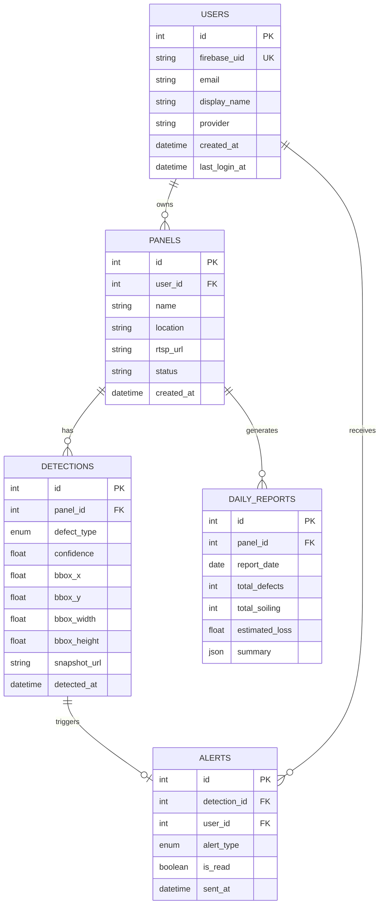
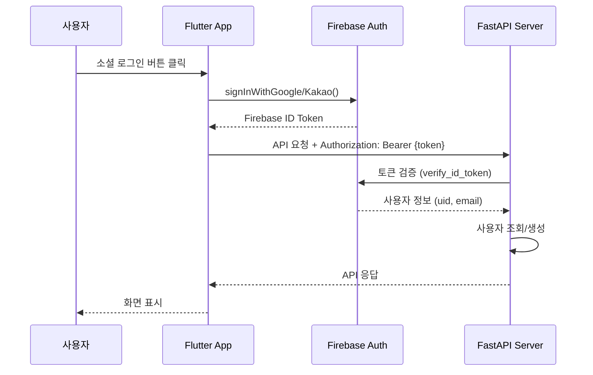

# [Tech Stack PRD] Solar-Eye: 기술 스택 상세 명세서

| 문서 정보 | 내용 |
| :--- | :--- |
| **프로젝트명** | Solar-Eye (솔라아이) |
| **버전** | v1.0 |
| **작성일** | 2026. 01. 15 |
| **작성자** | Solar-Eye Team |
| **유형** | 기술 스택 기획서 |

---

## 1. 문서 목적 (Purpose)

본 문서는 Solar-Eye 프로젝트의 **MVP(Minimum Viable Product)** 개발에 사용되는 기술 스택을 상세히 정의합니다. 각 기술의 선정 이유, 버전, 역할, 그리고 컴포넌트 간 상호작용을 명확히 기술하여 개발팀의 일관된 기술 기반을 확립합니다.

---

## 2. 기술 아키텍처 개요 (Architecture Overview)

### 2.1 시스템 구성도

```
┌─────────────────────────────────────────────────────────────────────────────┐
│                        Solar-Eye System Architecture                         │
├─────────────────────────────────────────────────────────────────────────────┤
│                                                                              │
│  ╔═══════════════╗                                                          │
│  ║   CCTV/DVR    ║                                                          │
│  ║  (RTSP 스트림) ║                                                          │
│  ╚═══════╦═══════╝                                                          │
│          │ RTSP Stream                                                       │
│          ▼                                                                   │
│  ┌───────────────────────────────────────────────────────────────────────┐  │
│  │                    🐳 Docker Compose Environment                       │  │
│  │  ┌─────────────────────────────────────────────────────────────────┐  │  │
│  │  │                    Backend Container (FastAPI)                   │  │  │
│  │  │                                                                  │  │  │
│  │  │  ┌────────────┐  ┌────────────┐  ┌────────────┐                │  │  │
│  │  │  │  Routers   │  │  Services  │  │   Models   │                │  │  │
│  │  │  │  (API)     │──│  (Logic)   │──│  (ORM)     │                │  │  │
│  │  │  └────────────┘  └─────┬──────┘  └────────────┘                │  │  │
│  │  │                        │                                        │  │  │
│  │  │                  ┌─────▼──────┐                                 │  │  │
│  │  │                  │ AI Engine  │                                 │  │  │
│  │  │                  │ SAM3+Clf   │                                 │  │  │
│  │  │                  └────────────┘                                 │  │  │
│  │  └─────────────────────────────────────────────────────────────────┘  │  │
│  │                        │                  │                            │  │
│  │                        ▼                  ▼                            │  │
│  │  ┌──────────────────────────┐  ┌──────────────────────────┐           │  │
│  │  │   PostgreSQL Container   │  │     Redis Container      │           │  │
│  │  │    (Persistent Data)     │  │   (Cache & Real-time)    │           │  │
│  │  └──────────────────────────┘  └──────────────────────────┘           │  │
│  └───────────────────────────────────────────────────────────────────────┘  │
│                              │                                               │
│                              ▼ REST API                                      │
│  ┌───────────────────────────────────────────────────────────────────────┐  │
│  │                         📱 Flutter App                                 │  │
│  │  ┌─────────────┐  ┌─────────────┐  ┌─────────────┐  ┌─────────────┐  │  │
│  │  │  Dashboard  │  │  Live View  │  │   Alerts    │  │   Reports   │  │  │
│  │  └─────────────┘  └─────────────┘  └─────────────┘  └─────────────┘  │  │
│  └───────────────────────────────────────────────────────────────────────┘  │
│                              │                                               │
│                              ▼                                               │
│  ╔═══════════════════════════════════════════════════════════════════════╗  │
│  ║                         ☁️ Firebase Services                           ║  │
│  ║  ┌─────────────────┐  ┌─────────────────┐  ┌─────────────────┐        ║  │
│  ║  │ Authentication  │  │ Cloud Messaging │  │    Analytics    │        ║  │
│  ║  │ (OAuth 2.0)     │  │ (FCM - Push)    │  │   (Crashlytics) │        ║  │
│  ║  └─────────────────┘  └─────────────────┘  └─────────────────┘        ║  │
│  ╚═══════════════════════════════════════════════════════════════════════╝  │
│                                                                              │
└─────────────────────────────────────────────────────────────────────────────┘
```

### 2.2 데이터 흐름 (Data Flow)

```
┌─────────┐     ┌──────────┐     ┌─────────────┐     ┌──────────────┐
│  CCTV   │────▶│  RTSP    │────▶│  Frame      │────▶│   SAM 3      │
│         │     │  Stream  │     │  Extractor  │     │  Segmentation│
└─────────┘     └──────────┘     └─────────────┘     └──────┬───────┘
                                                            │
                                                            ▼
┌─────────┐     ┌──────────┐     ┌─────────────┐     ┌──────────────┐
│  User   │◀────│  Push    │◀────│  Alert      │◀────│  Classifier  │
│  App    │     │  (FCM)   │     │  Engine     │     │  (결함 판단)  │
└─────────┘     └──────────┘     └─────────────┘     └──────────────┘
```

---

## 3. 백엔드 기술 스택 (Backend Stack)

### 3.1 핵심 프레임워크

| 기술 | 버전 | 용도 | 선정 이유 |
| :--- | :--- | :--- | :--- |
| **Python** | 3.10+ | 메인 언어 | AI/ML 생태계 최강, 풍부한 라이브러리 |
| **FastAPI** | 0.115+ | API 프레임워크 | 비동기 지원, 자동 문서화(Swagger/ReDoc), 높은 성능 |
| **Uvicorn** | 0.32+ | ASGI 서버 | 비동기 처리, 고성능 ASGI 서버 |
| **Gunicorn** | 23+ | 프로세스 관리자 | 멀티 워커 운영, Uvicorn 워커 관리 |

### 3.2 FastAPI 프로젝트 구조

```
solar_eye_backend/
├── app/
│   ├── __init__.py
│   ├── main.py                    # FastAPI 앱 진입점
│   ├── config.py                  # 환경 설정 관리
│   │
│   ├── api/                       # API 라우터
│   │   ├── __init__.py
│   │   ├── deps.py               # 의존성 주입
│   │   └── v1/
│   │       ├── __init__.py
│   │       ├── auth.py           # 인증 API
│   │       ├── panels.py         # 패널 관리 API
│   │       ├── alerts.py         # 알림 API
│   │       └── reports.py        # 리포트 API
│   │
│   ├── core/                      # 핵심 설정
│   │   ├── __init__.py
│   │   ├── security.py           # Firebase 토큰 검증
│   │   └── firebase.py           # Firebase Admin 초기화
│   │
│   ├── models/                    # SQLAlchemy 모델
│   │   ├── __init__.py
│   │   ├── user.py
│   │   ├── panel.py
│   │   ├── detection.py
│   │   └── alert.py
│   │
│   ├── schemas/                   # Pydantic 스키마
│   │   ├── __init__.py
│   │   ├── user.py
│   │   ├── panel.py
│   │   ├── detection.py
│   │   └── alert.py
│   │
│   ├── services/                  # 비즈니스 로직
│   │   ├── __init__.py
│   │   ├── auth_service.py
│   │   ├── panel_service.py
│   │   ├── detection_service.py
│   │   ├── alert_service.py
│   │   └── report_service.py
│   │
│   ├── ai/                        # AI 엔진 모듈
│   │   ├── __init__.py
│   │   ├── sam3_segmentor.py     # SAM3 세그멘테이션
│   │   ├── classifier.py         # 결함 분류기
│   │   ├── pipeline.py           # 2단계 파이프라인
│   │   └── models/               # 학습된 모델 저장
│   │       ├── sam3_weights.pt
│   │       └── classifier_weights.pt
│   │
│   └── db/                        # 데이터베이스
│       ├── __init__.py
│       ├── session.py            # DB 세션 관리
│       └── base.py               # Base 모델 정의
│
├── tests/                         # 테스트 코드
│   ├── __init__.py
│   ├── conftest.py
│   ├── test_auth.py
│   └── test_detection.py
│
├── alembic/                       # 마이그레이션
│   ├── versions/
│   └── env.py
│
├── docker/
│   ├── Dockerfile
│   └── docker-compose.yml
│
├── requirements.txt
├── pyproject.toml
└── .env.example
```

### 3.3 의존성 패키지 목록

```toml
# pyproject.toml

[project]
name = "solar-eye-backend"
version = "1.0.0"
requires-python = ">=3.10"

dependencies = [
    # 웹 프레임워크
    "fastapi>=0.115.0",
    "uvicorn[standard]>=0.32.0",
    "gunicorn>=23.0.0",
    
    # 데이터 검증
    "pydantic>=2.9.0",
    "pydantic-settings>=2.6.0",
    "email-validator>=2.2.0",
    
    # 데이터베이스
    "sqlalchemy>=2.0.36",
    "asyncpg>=0.30.0",                  # PostgreSQL 비동기 드라이버
    "alembic>=1.14.0",                  # 마이그레이션
    "redis>=5.2.0",                     # 캐시
    
    # 인증
    "firebase-admin>=6.6.0",            # Firebase Admin SDK
    "python-jose[cryptography]>=3.3.0", # JWT 처리
    "passlib[bcrypt]>=1.7.4",
    
    # AI/ML
    "torch>=2.5.0",
    "torchvision>=0.20.0",
    "opencv-python>=4.10.0",
    "numpy>=2.1.0",
    "pillow>=11.0.0",
    
    # 영상 처리
    "av>=13.0.0",                       # RTSP 스트리밍 처리
    
    # 유틸리티
    "python-multipart>=0.0.19",
    "python-dotenv>=1.0.1",
    "httpx>=0.28.0",                    # HTTP 클라이언트 (기상청 API 호출 포함)
    "aiofiles>=24.0.0",
]

[project.optional-dependencies]
dev = [
    "pytest>=8.3.0",
    "pytest-asyncio>=0.24.0",
    "pytest-cov>=6.0.0",
    "black>=24.10.0",
    "ruff>=0.8.0",
    "mypy>=1.13.0",
    "pre-commit>=4.0.0",
]
```

---

## 4. 데이터베이스 기술 스택 (Database Stack)

### 4.1 PostgreSQL (Main Database)

| 항목 | 내용 |
| :--- | :--- |
| **버전** | PostgreSQL 15.x |
| **드라이버** | asyncpg (비동기) |
| **ORM** | SQLAlchemy 2.0+ (Async) |
| **마이그레이션** | Alembic |
| **용도** | 사용자 정보, 패널 데이터, 탐지 이력, 알림 로그 |

#### 핵심 데이터 모델

```python
# models/detection.py
from sqlalchemy import Column, Integer, String, Float, DateTime, ForeignKey, Enum
from sqlalchemy.orm import relationship
from app.db.base import Base
import enum

class DefectType(str, enum.Enum):
    DEFECT = "defect"      # 기계적 결함 (파손, 크랙 등)
    SOILING = "soiling"    # 오염 (먼지, 새똥 등)
    NORMAL = "normal"      # 정상

class Detection(Base):
    __tablename__ = "detections"
    
    id = Column(Integer, primary_key=True, index=True)
    panel_id = Column(Integer, ForeignKey("panels.id"), nullable=False)
    defect_type = Column(Enum(DefectType), nullable=False)
    confidence = Column(Float, nullable=False)
    bbox_x = Column(Float)           # Bounding Box 좌표
    bbox_y = Column(Float)
    bbox_width = Column(Float)
    bbox_height = Column(Float)
    snapshot_url = Column(String)    # 스냅샷 이미지 URL
    detected_at = Column(DateTime, nullable=False)
    
    # 관계
    panel = relationship("Panel", back_populates="detections")
    alerts = relationship("Alert", back_populates="detection")
```

#### ERD (Entity Relationship Diagram)



### 4.2 Redis (Cache & Real-time)

| 항목 | 내용 |
| :--- | :--- |
| **버전** | Redis 7.x |
| **클라이언트** | redis-py (async) |
| **용도** | 세션 캐시, 실시간 탐지 결과, Rate Limiting, Pub/Sub |

#### Redis 키 설계

```python
# 캐시 키 패턴
REDIS_KEYS = {
    # 사용자 세션 (TTL: 24시간)
    "session": "session:{user_id}",
    
    # 최근 탐지 결과 캐시 (TTL: 5분)
    "detection_latest": "detection:latest:{panel_id}",
    
    # 패널 상태 캐시 (TTL: 1분)
    "panel_status": "panel:status:{panel_id}",
    
    # 일일 통계 캐시 (TTL: 1시간)
    "daily_stats": "stats:daily:{panel_id}:{date}",
    
    # Rate Limiting (TTL: 1분)
    "rate_limit": "ratelimit:{user_id}:{endpoint}",
}
```

---

## 5. AI/ML 기술 스택 (AI Engine)

### 5.1 AI 프레임워크

| 기술 | 버전 | 용도 | 비고 |
| :--- | :--- | :--- | :--- |
| **PyTorch** | 2.5+ | 딥러닝 프레임워크 | GPU 가속 지원 |
| **SAM 3** | Latest | 패널 세그멘테이션 | Meta AI Zero-shot Segmentation |
| **EfficientNet-B3** | timm | 결함 분류기 | 경량 고정확도 모델 |
| **OpenCV** | 4.10+ | 영상 처리 | 프레임 추출, 전처리 |
| **ONNX Runtime** | 1.20+ | 추론 최적화 | (선택) 프로덕션 최적화 |

### 5.2 2단계 AI 파이프라인 상세

```python
# ai/pipeline.py

class SolarPanelDetectionPipeline:
    """
    2단계 AI 파이프라인
    Stage 1: SAM3로 패널 영역 세그멘테이션
    Stage 2: 분류기로 결함 유형 판단
    """
    
    def __init__(self, sam_model_path: str, classifier_path: str):
        self.sam = SAM3Segmentor(sam_model_path)
        self.classifier = DefectClassifier(classifier_path)
        
    async def process_frame(self, frame: np.ndarray) -> List[DetectionResult]:
        # Stage 1: 패널 영역 추출
        panel_masks = await self.sam.segment_panels(frame)
        
        results = []
        for mask in panel_masks:
            # 패널 영역 크롭
            cropped_panel = self._apply_mask_and_crop(frame, mask)
            
            # Stage 2: 결함 분류
            defect_type, confidence = await self.classifier.classify(cropped_panel)
            
            results.append(DetectionResult(
                defect_type=defect_type,
                confidence=confidence,
                bbox=mask.bbox,
                mask=mask
            ))
        
        return results
```

### 5.3 모델 성능 요구사항

> **Target Device:** NVIDIA L4 GPU (24GB VRAM)

| 지표 | 목표치 | 측정 방법 |
| :--- | :--- | :--- |
| **분류 정확도 (Accuracy)** | ≥ 90% | Test Set 기준 |
| **Defect Recall** | ≥ 95% | 결함 미탐지 최소화 |
| **Shadow 오탐률** | < 5% | 그림자 → 결함 오분류 |
| **추론 시간** | < 50ms/frame | **L4 GPU 기준 (FP16)** |
| **전체 FPS** | ≥ 20 FPS | 실시간 처리 기준 |

#### 추론 최적화 전략 (Inference Optimization)

| 최적화 기법 | 설명 | 기대 효과 |
| :--- | :--- | :--- |
| **FP16 (Half Precision)** | L4 GPU의 Tensor Core를 활용한 16비트 부동소수점 연산 | 추론 속도 **~2배 향상**, 메모리 사용량 50% 절감 |
| **BFloat16** | 동적 범위가 넓은 Brain Floating Point 16 적용 (PyTorch 2.0+ 지원) | 정확도 손실 최소화하면서 성능 향상 |
| **torch.compile()** | PyTorch 2.0+ 동적 컴파일 적용 | 추가 10~30% 속도 향상 |
| **Batch Inference** | 프레임 배치 처리 (batch_size=4) | GPU 활용률 극대화 |

```python
# ai/pipeline.py - FP16 추론 적용 예시
import torch

class SolarPanelDetectionPipeline:
    def __init__(self, sam_model_path: str, classifier_path: str):
        self.device = torch.device("cuda" if torch.cuda.is_available() else "cpu")
        self.dtype = torch.float16  # L4 GPU FP16 최적화
        
        # 모델 로드 및 FP16 변환
        self.sam = SAM3Segmentor(sam_model_path).to(self.device, dtype=self.dtype)
        self.classifier = DefectClassifier(classifier_path).to(self.device, dtype=self.dtype)
        
        # torch.compile 적용 (PyTorch 2.0+)
        self.classifier = torch.compile(self.classifier, mode="reduce-overhead")
```

---

## 6. 프론트엔드 기술 스택 (Frontend - Mobile App)

### 6.1 Flutter 앱 스택

| 기술 | 버전 | 용도 |
| :--- | :--- | :--- |
| **Flutter** | 3.24+ | 크로스플랫폼 UI 프레임워크 |
| **Dart** | 3.5+ | 프로그래밍 언어 |
| **Material 3** | Built-in | 디자인 시스템 |

### 6.2 주요 패키지

```yaml
# pubspec.yaml

dependencies:
  flutter:
    sdk: flutter
  
  # 상태 관리
  riverpod: ^2.6.1
  flutter_riverpod: ^2.6.1
  
  # 네트워크
  dio: ^5.7.0
  retrofit: ^4.4.0
  
  # Firebase
  firebase_core: ^3.8.0
  firebase_auth: ^5.3.3
  firebase_messaging: ^15.1.5
  firebase_analytics: ^11.3.5
  
  # 소셜 로그인
  google_sign_in: ^6.2.2
  kakao_flutter_sdk_user: ^1.9.7
  
  # 영상 스트리밍
  flutter_vlc_player: ^7.4.3        # RTSP 재생
  
  # UI/UX
  fl_chart: ^0.69.2                 # 차트
  flutter_local_notifications: ^18.0.1
  cached_network_image: ^3.4.1
  shimmer: ^3.0.0                   # 로딩 효과
  
  # 유틸리티
  flutter_secure_storage: ^9.2.2
  intl: ^0.19.0
  freezed_annotation: ^2.4.4
  json_annotation: ^4.9.0

dev_dependencies:
  flutter_test:
    sdk: flutter
  build_runner: ^2.4.13
  freezed: ^2.5.7
  json_serializable: ^6.8.0
  retrofit_generator: ^9.1.2
```

### 6.3 Flutter 프로젝트 구조

```
solar_eye_app/
├── lib/
│   ├── main.dart
│   ├── app.dart
│   │
│   ├── core/
│   │   ├── constants/
│   │   │   ├── api_constants.dart
│   │   │   └── theme_constants.dart
│   │   ├── theme/
│   │   │   ├── app_theme.dart
│   │   │   └── app_colors.dart
│   │   ├── utils/
│   │   │   ├── date_utils.dart
│   │   │   └── validators.dart
│   │   └── di/
│   │       └── injection.dart
│   │
│   ├── data/
│   │   ├── datasources/
│   │   │   ├── remote/
│   │   │   │   └── api_client.dart
│   │   │   └── local/
│   │   │       └── secure_storage.dart
│   │   ├── models/
│   │   │   ├── user_model.dart
│   │   │   ├── panel_model.dart
│   │   │   ├── detection_model.dart
│   │   │   └── alert_model.dart
│   │   └── repositories/
│   │       ├── auth_repository.dart
│   │       ├── panel_repository.dart
│   │       └── alert_repository.dart
│   │
│   ├── domain/
│   │   ├── entities/
│   │   ├── repositories/
│   │   └── usecases/
│   │
│   ├── presentation/
│   │   ├── providers/
│   │   │   ├── auth_provider.dart
│   │   │   └── panel_provider.dart
│   │   ├── screens/
│   │   │   ├── splash/
│   │   │   ├── auth/
│   │   │   │   └── login_screen.dart
│   │   │   ├── dashboard/
│   │   │   │   └── dashboard_screen.dart
│   │   │   ├── monitoring/
│   │   │   │   └── live_view_screen.dart
│   │   │   ├── alerts/
│   │   │   │   └── alerts_screen.dart
│   │   │   └── reports/
│   │   │       └── reports_screen.dart
│   │   └── widgets/
│   │       ├── common/
│   │       ├── charts/
│   │       └── cards/
│   │
│   └── routes/
│       └── app_router.dart
│
├── assets/
│   ├── images/
│   ├── fonts/
│   └── icons/
│
├── test/
├── android/
├── ios/
└── pubspec.yaml
```

---

## 7. 인증 시스템 (Authentication)

### 7.1 Firebase Authentication

| 항목 | 설명 |
| :--- | :--- |
| **Provider** | Firebase Authentication |
| **지원 로그인** | Google OAuth 2.0, Kakao OAuth 2.0 |
| **토큰 방식** | Firebase ID Token (JWT) |
| **토큰 수명** | 1시간 (자동 갱신) |

### 7.2 인증 흐름



### 7.3 백엔드 토큰 검증

```python
# core/security.py

from firebase_admin import auth
from fastapi import HTTPException, Depends
from fastapi.security import HTTPBearer, HTTPAuthorizationCredentials

security = HTTPBearer()

async def get_current_user(
    credentials: HTTPAuthorizationCredentials = Depends(security)
) -> dict:
    """Firebase ID Token 검증 및 사용자 정보 반환"""
    try:
        token = credentials.credentials
        decoded_token = auth.verify_id_token(token)
        
        return {
            "uid": decoded_token["uid"],
            "email": decoded_token.get("email"),
            "name": decoded_token.get("name"),
            "provider": decoded_token.get("firebase", {}).get("sign_in_provider")
        }
    except Exception as e:
        raise HTTPException(status_code=401, detail="Invalid authentication token")
```

---

## 8. 인프라 및 배포 (Infrastructure & Deployment)

### 8.1 컨테이너화 (Docker)

#### Dockerfile 권장사항

> [!IMPORTANT]
> L4 GPU 성능을 최대한 활용하기 위해 **CUDA 11.8 이상**을 지원하는 PyTorch 베이스 이미지를 사용합니다.

```dockerfile
# docker/Dockerfile

# L4 GPU 최적화를 위한 CUDA 11.8+ PyTorch 베이스 이미지
FROM pytorch/pytorch:2.5.0-cuda11.8-cudnn9-runtime

# OpenCV 의존성 (headless 서버 환경)
RUN apt-get update && apt-get install -y \
    libgl1-mesa-glx \
    libglib2.0-0 \
    && rm -rf /var/lib/apt/lists/*

WORKDIR /app

COPY requirements.txt .
RUN pip install --no-cache-dir -r requirements.txt

COPY . .

CMD ["uvicorn", "app.main:app", "--host", "0.0.0.0", "--port", "8000"]
```

#### Docker Compose 설정

```yaml
# docker/docker-compose.yml
#
# [Prerequisites] GPU 사용을 위해 호스트에 아래 패키지가 설치되어 있어야 합니다:
#   - NVIDIA Driver (525+)
#   - nvidia-container-toolkit (https://docs.nvidia.com/datacenter/cloud-native/container-toolkit/install-guide.html)
#
# 설치 후 Docker 데몬 재시작 필요:
#   $ sudo systemctl restart docker

version: '3.8'

services:
  backend:
    build:
      context: ..
      dockerfile: docker/Dockerfile
    container_name: solar-eye-api
    ports:
      - "8000:8000"
    environment:
      - DATABASE_URL=postgresql+asyncpg://postgres:password@db:5432/solar_eye
      - REDIS_URL=redis://redis:6379/0
      - GOOGLE_APPLICATION_CREDENTIALS=/app/firebase-credentials.json
      # L4 GPU FP16 최적화 활성화
      - TORCH_DTYPE=float16
    volumes:
      - ../app:/app/app
      - ./firebase-credentials.json:/app/firebase-credentials.json:ro
    depends_on:
      - db
      - redis
    # GPU 사용 설정 (nvidia-container-toolkit 필수)
    deploy:
      resources:
        reservations:
          devices:
            - driver: nvidia
              count: 1
              capabilities: [gpu]

  db:
    image: postgres:15-alpine
    container_name: solar-eye-db
    environment:
      - POSTGRES_USER=postgres
      - POSTGRES_PASSWORD=password
      - POSTGRES_DB=solar_eye
    volumes:
      - postgres_data:/var/lib/postgresql/data
    ports:
      - "5432:5432"

  redis:
    image: redis:7-alpine
    container_name: solar-eye-redis
    ports:
      - "6379:6379"
    volumes:
      - redis_data:/data

volumes:
  postgres_data:
  redis_data:
```

### 8.2 클라우드 인프라 (GCP)

> **Region:** `asia-northeast3` (Seoul) - 데이터 전송 지연(Latency) 및 Egress Fee 절감

| 항목 | 스펙 | 비고 |
| :--- | :--- | :--- |
| **Region** | `asia-northeast3` (Seoul) | 국내 사용자 대상 최적화 |
| **Instance Type** | `g2-standard-4` | vCPU 4, RAM 16GB, L4 GPU 최적화 머신 타입 |
| **GPU** | **NVIDIA L4 (24GB)** × 1ea | T4 대비 영상 처리 및 추론 성능 우수 |
| **OS Image** | Deep Learning VM (Ubuntu 22.04 LTS) | NVIDIA 드라이버(CUDA 11.8+) 사전 설치 |
| **Boot Disk** | SSD 100GB | 모델 및 Docker 이미지 저장 |
| **Cloud Storage** | Standard (asia-northeast3) | 모델 가중치, 스냅샷 이미지 저장 |
| **Cloud SQL** | PostgreSQL 15 (db-f1-micro) | 데이터베이스 (선택) |
| **Cloud Armor** | Basic | DDoS 방어 (선택) |

#### NVIDIA L4 GPU vs T4 비교

| 항목 | **L4 (권장)** | T4 |
| :--- | :--- | :--- |
| **VRAM** | 24GB GDDR6 | 16GB GDDR6 |
| **CUDA Cores** | 7,424 | 2,560 |
| **Tensor Cores** | 4세대 (FP8 지원) | 3세대 |
| **TDP** | 72W | 70W |
| **FP16 성능** | 121 TFLOPS | 65 TFLOPS |
| **추론 성능** | **~2배 우수** | 기준 |

> [!TIP]
> **Deep Learning VM Image** 사용 시 NVIDIA 드라이버, CUDA, cuDNN이 사전 설치되어 있어 별도 GPU 드라이버 설치가 필요 없습니다.

### 8.3 MVP 배포 구성

```
┌─────────────────────────────────────────────────────────────────┐
│                     GCP Compute Engine                           │
│           Region: asia-northeast3 (Seoul)                        │
│         Instance: g2-standard-4 + NVIDIA L4 GPU                  │
│        OS: Deep Learning VM (Ubuntu 22.04 LTS)                   │
│  ┌───────────────────────────────────────────────────────────┐  │
│  │                    Docker Compose                          │  │
│  │                                                            │  │
│  │  ┌──────────┐   ┌──────────┐   ┌──────────────────────┐   │  │
│  │  │ FastAPI  │   │PostgreSQL│   │       Redis          │   │  │
│  │  │ + SAM3   │   │    15    │   │         7            │   │  │
│  │  │(L4 FP16) │   │          │   │                      │   │  │
│  │  └──────────┘   └──────────┘   └──────────────────────┘   │  │
│  └───────────────────────────────────────────────────────────┘  │
│                              ▲                                   │
│                              │ HTTPS (443)                       │
│                              │                                   │
│  ┌───────────────────────────────────────────────────────────┐  │
│  │                    Nginx (Reverse Proxy)                   │  │
│  │                   + Let's Encrypt SSL                      │  │
│  └───────────────────────────────────────────────────────────┘  │
└─────────────────────────────────────────────────────────────────┘
```

---

## 9. 개발 도구 및 품질 관리 (Dev Tools & QA)

### 9.1 개발 환경

| 도구 | 용도 |
| :--- | :--- |
| **VS Code / Cursor** | 코드 에디터 |
| **Git / GitHub** | 버전 관리 |
| **Docker Desktop** | 로컬 컨테이너 환경 |
| **Postman** | API 테스트 |
| **DBeaver** | 데이터베이스 클라이언트 |

### 9.2 코드 품질 도구

| 도구 | 용도 | 적용 범위 |
| :--- | :--- | :--- |
| **Black** | Python 포맷터 | Backend |
| **Ruff** | Python 린터 (빠름) | Backend |
| **MyPy** | Python 타입 체커 | Backend |
| **Pytest** | Python 테스트 | Backend |
| **Flutter Analyzer** | Dart 분석 | App |
| **Pre-commit** | Git Hook 자동화 | 전체 |

### 9.3 Pre-commit 설정

```yaml
# .pre-commit-config.yaml

repos:
  - repo: https://github.com/psf/black
    rev: 24.10.0
    hooks:
      - id: black
        language_version: python3.10

  - repo: https://github.com/astral-sh/ruff-pre-commit
    rev: v0.8.0
    hooks:
      - id: ruff
        args: [--fix]

  - repo: https://github.com/pre-commit/mirrors-mypy
    rev: v1.13.0
    hooks:
      - id: mypy
        additional_dependencies: [pydantic>=2.0]
```

---

## 10. API 명세 요약 (API Specification)

### 10.1 인증 API

| Method | Endpoint | 설명 |
| :--- | :--- | :--- |
| POST | `/api/v1/auth/login` | 소셜 로그인 후 사용자 등록/조회 |
| GET | `/api/v1/auth/me` | 현재 사용자 정보 조회 |
| POST | `/api/v1/auth/fcm-token` | FCM 토큰 등록 |

### 10.2 패널 API

| Method | Endpoint | 설명 |
| :--- | :--- | :--- |
| GET | `/api/v1/panels` | 패널 목록 조회 |
| POST | `/api/v1/panels` | 패널 등록 (RTSP URL) |
| GET | `/api/v1/panels/{id}` | 패널 상세 조회 |
| GET | `/api/v1/panels/{id}/status` | 패널 현재 상태 (실시간) |

### 10.3 탐지 API

| Method | Endpoint | 설명 |
| :--- | :--- | :--- |
| GET | `/api/v1/detections` | 탐지 이력 조회 (필터링) |
| GET | `/api/v1/detections/{id}` | 탐지 상세 조회 |

### 10.4 알림 API

| Method | Endpoint | 설명 |
| :--- | :--- | :--- |
| GET | `/api/v1/alerts` | 알림 목록 조회 |
| PUT | `/api/v1/alerts/{id}/read` | 알림 읽음 처리 |

### 10.5 리포트 API

| Method | Endpoint | 설명 |
| :--- | :--- | :--- |
| GET | `/api/v1/reports/daily` | 일간 리포트 조회 |
| GET | `/api/v1/reports/weekly` | 주간 리포트 조회 |
| GET | `/api/v1/reports/economic` | 경제성 분석 리포트 |

### 10.6 날씨 API (Weather)

| Method | Endpoint | 설명 |
| :--- | :--- | :--- |
| GET | `/api/v1/weather/current` | 현재 날씨 정보 조회 |
| GET | `/api/v1/weather/forecast` | 단기 예보 조회 (12시간/3일) |
| GET | `/api/v1/weather/status` | 우천 여부 확인 (알림 중지 판단용) |

#### 기상청 API 연동 상세

```python
# services/weather_service.py

import httpx
from datetime import datetime
from app.config import settings

class WeatherService:
    """기상청 단기예보 API 연동 서비스"""
    
    BASE_URL = "http://apis.data.go.kr/1360000/VilageFcstInfoService_2.0"
    
    def __init__(self):
        self.api_key = settings.KMA_API_KEY  # 공공데이터포털 인증키
    
    async def get_current_weather(self, nx: int, ny: int) -> dict:
        """초단기실황 조회"""
        async with httpx.AsyncClient() as client:
            response = await client.get(
                f"{self.BASE_URL}/getUltraSrtNcst",
                params={
                    "serviceKey": self.api_key,
                    "dataType": "JSON",
                    "base_date": datetime.now().strftime("%Y%m%d"),
                    "base_time": self._get_base_time(),
                    "nx": nx,  # 격자 X 좌표
                    "ny": ny,  # 격자 Y 좌표
                }
            )
            return self._parse_weather_response(response.json())
    
    def is_rainy(self, weather_data: dict) -> bool:
        """우천 여부 확인 (PTY: 0=없음, 1=비, 2=비/눈, 3=눈)"""
        return weather_data.get("PTY", "0") != "0"
```

#### 환경 변수 설정

```bash
# .env
KMA_API_KEY=your_public_data_portal_api_key
KMA_DEFAULT_NX=60   # 기본 격자 X 좌표 (서울)
KMA_DEFAULT_NY=127  # 기본 격자 Y 좌표 (서울)
```

## 11. 보안 고려사항 (Security - MVP)

> [!NOTE]
> MVP 단계에서는 기본적인 보안만 적용하며, Phase 2에서 고도화합니다.

| 항목 | MVP 적용 | Phase 2 고도화 |
| :--- | :--- | :--- |
| **HTTPS** | ✅ Let's Encrypt SSL | 유지 |
| **인증** | ✅ Firebase ID Token | 추가 검증 로직 |
| **환경변수** | ✅ .env 파일 관리 | Secret Manager |
| **SQL Injection** | ✅ SQLAlchemy ORM | 유지 |
| **Rate Limiting** | ❌ 미적용 | Redis 기반 구현 |
| **Input Validation** | ✅ Pydantic | 강화 |

---

## 12. 모니터링 및 로깅 (Monitoring - MVP)

| 항목 | MVP 적용 | 도구 |
| :--- | :--- | :--- |
| **앱 크래시** | ✅ | Firebase Crashlytics |
| **앱 분석** | ✅ | Firebase Analytics |
| **서버 로그** | ✅ | Python logging + 파일 |
| **서버 메트릭** | ❌ | (Phase 2: Prometheus + Grafana) |

---

## 13. 개발 일정 (Development Timeline)

> **프로젝트 기간:** 2026.01.15 ~ 2026.02.13 (약 4주)

### 📅 주요 마일스톤

| 마일스톤 | 날짜 | 목표 |
| :--- | :--- | :--- |
| **🚀 1차 발표** | 2026.01.28 (화) | 핵심 기능 구현 완료 (AI 탐지 + 앱 기본 화면) |
| **🎯 최종 발표** | 2026.02.11 ~ 02.13 | 전체 기능 완성 + 안정화 |

### 📋 스프린트 일정

| Sprint | 기간 | 주요 작업 | 목표 |
| :--- | :--- | :--- | :--- |
| **Sprint 1** | 01.15 ~ 01.21 (1주) | 백엔드 기본 구조, DB 설계, 인증 연동, 기상청 API 연동 | 서버 기반 완성 |
| **Sprint 2** | 01.22 ~ 01.28 (1주) | AI 파이프라인 통합, 기본 API 완성, Flutter 앱 핵심 화면 | **⭐ 1차 발표** |
| **Sprint 3** | 01.29 ~ 02.04 (1주) | 실시간 스트리밍, 알림 시스템, 앱 전체 화면 구현 | 기능 완성 |
| **Sprint 4** | 02.05 ~ 02.13 (1주+) | 통합 테스트, 버그 수정, UI 폴리싱, 발표 자료 준비 | **⭐ 최종 발표** |

### 🎯 1차 발표 필수 구현 항목 (01.28까지)

- [ ] 백엔드 API 서버 동작 (FastAPI + PostgreSQL)
- [ ] AI 결함 탐지 파이프라인 (SAM3 + Classifier)
- [ ] Flutter 앱 기본 화면 (대시보드, 모니터링)
- [ ] 소셜 로그인 (Google/Kakao)
- [ ] 기상청 API 연동 (날씨 표시)

### 🏁 최종 발표 완성 항목 (02.11~13까지)

- [ ] RTSP 실시간 스트리밍
- [ ] 푸시 알림 시스템 (FCM)
- [ ] 리포트 화면 (경제성 분석)
- [ ] 우천 시 알림 중지 기능
- [ ] 통합 테스트 완료
- [ ] 발표 자료 및 데모 준비

---

## 14. 부록 (Appendix)

### 14.1 참고 문서

| 문서 | 링크 |
| :--- | :--- |
| FastAPI 공식 문서 | https://fastapi.tiangolo.com |
| SQLAlchemy 2.0 | https://docs.sqlalchemy.org |
| Flutter 공식 문서 | https://docs.flutter.dev |
| Firebase Auth | https://firebase.google.com/docs/auth |
| SAM (Segment Anything) | https://segment-anything.com |

### 14.2 변경 이력

| 버전 | 날짜 | 변경 내용 |
| :--- | :--- | :--- |
| v1.0 | 2026.01.15 | 초안 작성 - MVP 기술 스택 정의 |
