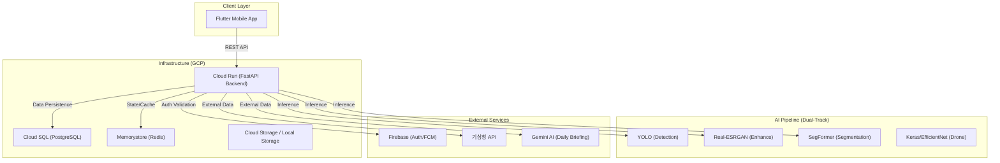

# Solar Eye 시스템 아키텍처 (Technical Architecture)

Solar Eye는 AI 기반 태양광 패널 결함 탐지 및 관리 플랫폼입니다. 본 문서는 전체 시스템의 구조와 구성 요소를 설명합니다.

## 1. 전반적인 아키텍처 흐름

## 2. 주요 구성 요소

### 2.1. Frontend (Mobile App)
- **Framework**: Flutter (Dart)
- **State Management**: Riverpod
- **Key Features**: 
    - 실시간 시설 현황 대시보드
    - AI 분석 결과 시각화 (Bounding Box & Mask Overlay)
    - 이상 감지 시 즉시 알림 (FCM)

### 2.2. Backend (API Server)
- **Framework**: FastAPI (Python 3.10+)
- **ORM**: SQLAlchemy (Async)
- **Migration**: Alembic
- **Key Features**:
    - AI 분석 파이프라인 관리
    - 기상 데이터 기반 분석 및 Gemini 활용 발전량 브리핑 생성
    - 발전 시설 및 패널 인벤토리 관리

### 2.3. AI Analysis Pipeline (Dual-Track Strategy)
NVIDIA L4 GPU 환경에 최적화된 2가지 트랙을 제공합니다.

| 분류 | CCTV 트랙 (저해상도/원거리) | 드론 트랙 (고해상도/근거리) |
| :--- | :--- | :--- |
| **목적** | 상시 모니터링, 작은 결함 정밀 분석 | 점검 이미지 분류, 빠른 처리 |
| **탐지 (Detection)** | YOLO26m (1024px) | YOLO26m (80k dataset) |
| **강화 (Enhance)** | Real-ESRGAN (x4 Upscale) | - |
| **분석 (Analysis)** | SegFormer (Pixel-level) | Keras (EfficientNet-based) |

### 2.4. Infrastructure (Cloud Setup)
- **Computing**: Google Cloud Run (Serverless Docker)
- **Database**: Cloud SQL for PostgreSQL (PostgreSQL 15)
- **Caching**: Memorystore for Redis
- **Container Registry**: Artifact Registry
- **Secrets Management**: Secret Manager (Firebase Admin Key 등)

## 3. 데이터 보안 및 통신
- **Authentication**: Firebase Auth (Bearer Token 검증)
- **Notifications**: Firebase Cloud Messaging (FCM)
- **Storage**: 정적 파일 및 업로드 이미지 관리 (현재는 로컬/서버 내 볼륨)
